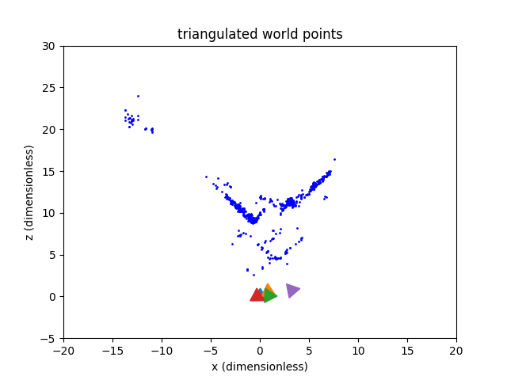

# Structure from Motion (SfM) and Neural Radiance Fields (NeRF) Project

<!--  -->
<!--  -->
<!-- 
 -->
<!-- <p float="left"> -->
  
<!--   
   
</p> -->

|  |  |
|:--:|:---:|
| NeRF | SFM |


This repository contains the academic project exploring computer graphics for 3D rendering with Neural Radiance Fields (NeRF) and Structure from Motion (SfM) techniques. The project was conducted as part of the RBE-549 course during the spring semester of 2023. The official university course project page can be found [here](https://rbe549.github.io/spring2023/proj/p2/).


## Table of Contents
- [About The Project](#about-the-project)
- [Repository Structure](#repository-structure)
- [Technologies](#technologies)
- [Installation & Usage](#installation--usage)
- [Contributing](#contributing)


## About The Project
The project was conducted from February to March 2023 and focused on applying SfM and NeRF techniques on a dataset of five images of a glass building. The primary goals of the project were:

Implement feature matching, epipolar geometry, RANSAC, visibility matrix, and bundle adjustment techniques for SfM.
Develop a data loader, parser, network, and loss function for NeRF.
Generate a 3D reconstruction of the scene using the combined SfM and NeRF techniques.

## Repository Structure
The repository is structured as follows:

- `/src`: This folder contains all the source code for the project, including implementations of SfM and NeRF algorithms.
- `/report`: This folder contains the academic report documenting the project, including the methodology, experimental results, and conclusions.
- `/data`: This folder contains the image dataset used for the project.

## Technologies
The project utilizes the following technologies:

- NeRF: Neural Radiance Fields for volumetric scene representation.
- SfM: Structure from Motion for estimating the 3D structure of the scene.
- Epipolar Geometry & RANSAC: Techniques for accurate estimation of 3D points from multiple views.
- Visibility Matrix: Method for handling occlusions in the scene reconstruction.
- Bundle Adjustment: Technique for refining the estimates of 3D points and camera parameters.

## Installation & Usage
To run the project locally, follow these steps:

1. Clone the repository:

```shell
git clone https://github.com/Prasannanatu/sfm_and_nerf.git
